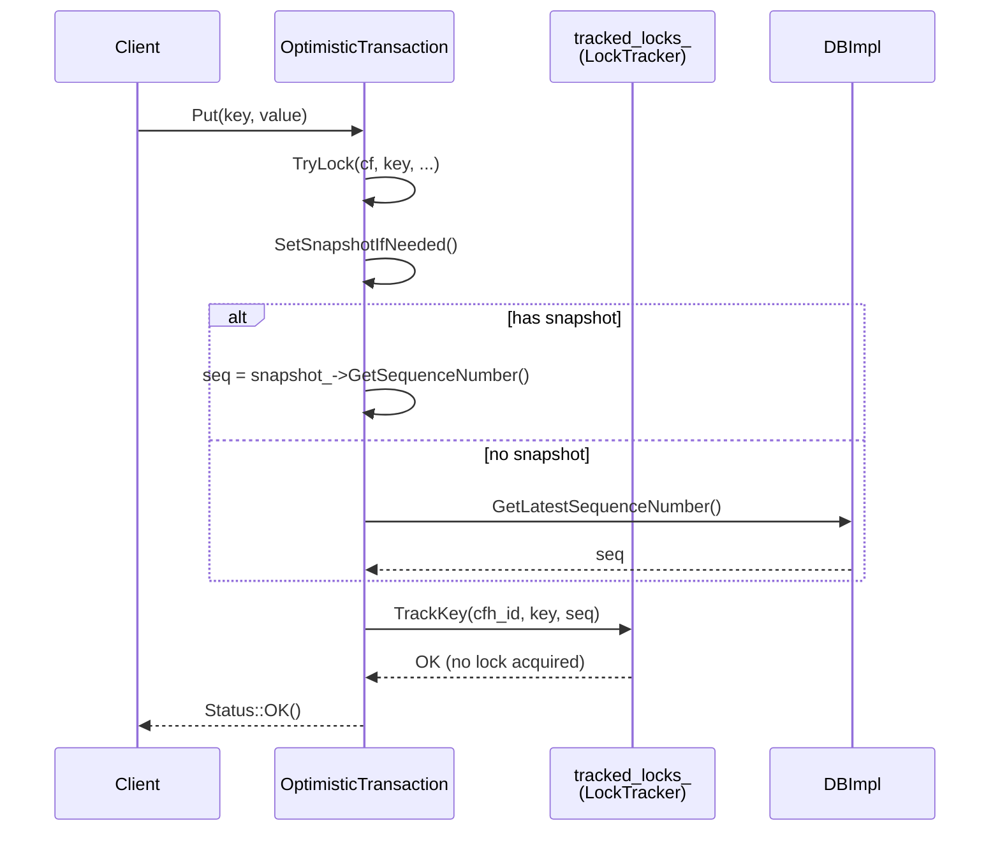
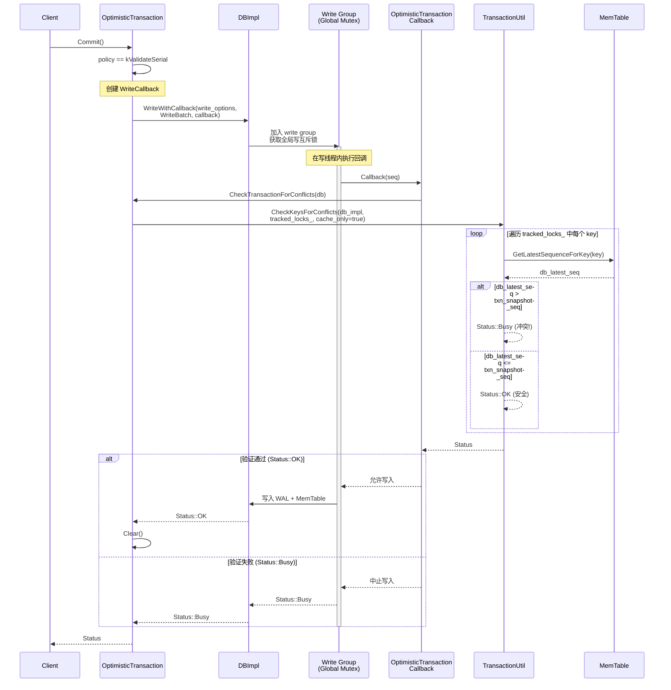
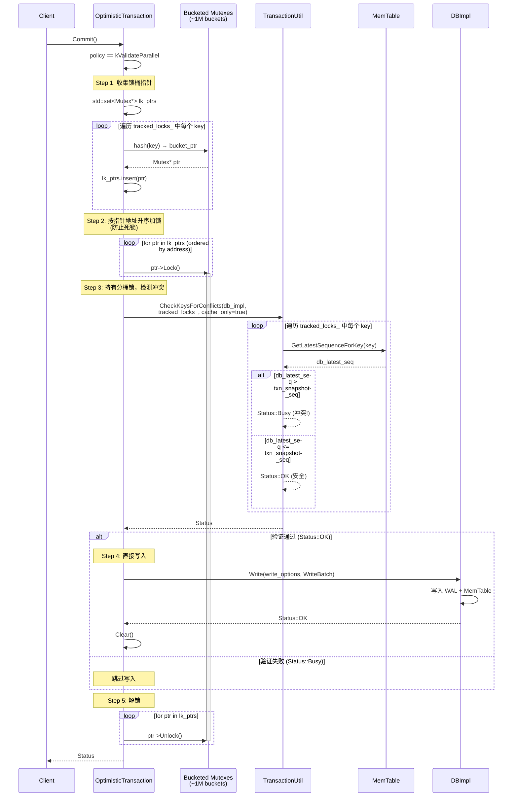
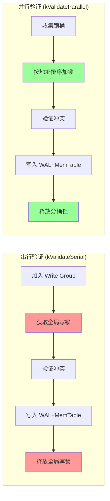

# OCC Commit Validation Sequence Diagram

## 写入阶段（TryLock - 只记录不加锁）

```mermaid
sequenceDiagram
    participant Client
    participant OptTxn as OptimisticTransaction
    participant TrackedLocks as tracked_locks_<br/>(LockTracker)
    participant DB as DBImpl

    Client->>OptTxn: Put(key, value)
    OptTxn->>OptTxn: TryLock(cf, key, ...)
    OptTxn->>OptTxn: SetSnapshotIfNeeded()
    alt has snapshot
        OptTxn->>OptTxn: seq = snapshot_->GetSequenceNumber()
    else no snapshot
        OptTxn->>DB: GetLatestSequenceNumber()
        DB-->>OptTxn: seq
    end
    OptTxn->>TrackedLocks: TrackKey(cfh_id, key, seq)
    TrackedLocks-->>OptTxn: OK (no lock acquired)
    OptTxn-->>Client: Status::OK()
```

## 串行验证提交流程 (kValidateSerial)

```mermaid
sequenceDiagram
    participant Client
    participant OptTxn as OptimisticTransaction
    participant DBImpl
    participant WriteGroup as Write Group<br/>(Global Mutex)
    participant Callback as OptimisticTransaction<br/>Callback
    participant TxnUtil as TransactionUtil
    participant MemTable

    Client->>OptTxn: Commit()
    OptTxn->>OptTxn: policy == kValidateSerial

    Note over OptTxn: 创建 WriteCallback
    OptTxn->>DBImpl: WriteWithCallback(write_options,<br/>WriteBatch, callback)

    DBImpl->>WriteGroup: 加入 write group<br/>获取全局写互斥锁
    activate WriteGroup

    Note over WriteGroup: 在写线程内执行回调
    WriteGroup->>Callback: Callback(seq)
    Callback->>OptTxn: CheckTransactionForConflicts(db)
    OptTxn->>TxnUtil: CheckKeysForConflicts(db_impl,<br/>tracked_locks_, cache_only=true)

    loop 遍历 tracked_locks_ 中每个 key
        TxnUtil->>MemTable: GetLatestSequenceForKey(key)
        MemTable-->>TxnUtil: db_latest_seq
        alt db_latest_seq > txn_snapshot_seq
            TxnUtil-->>TxnUtil: Status::Busy (冲突!)
        else db_latest_seq <= txn_snapshot_seq
            TxnUtil-->>TxnUtil: Status::OK (安全)
        end
    end

    TxnUtil-->>Callback: Status

    alt 验证通过 (Status::OK)
        Callback-->>WriteGroup: 允许写入
        WriteGroup->>DBImpl: 写入 WAL + MemTable
        DBImpl-->>OptTxn: Status::OK
        OptTxn->>OptTxn: Clear()
    else 验证失败 (Status::Busy)
        Callback-->>WriteGroup: 中止写入
        WriteGroup-->>DBImpl: Status::Busy
        DBImpl-->>OptTxn: Status::Busy
    end

    deactivate WriteGroup
    OptTxn-->>Client: Status
```

## 并行验证提交流程 (kValidateParallel)

```mermaid
sequenceDiagram
    participant Client
    participant OptTxn as OptimisticTransaction
    participant BucketLocks as Bucketed Mutexes<br/>(~1M buckets)
    participant TxnUtil as TransactionUtil
    participant MemTable
    participant DBImpl

    Client->>OptTxn: Commit()
    OptTxn->>OptTxn: policy == kValidateParallel

    Note over OptTxn: Step 1: 收集锁桶指针
    OptTxn->>OptTxn: std::set<Mutex*> lk_ptrs
    loop 遍历 tracked_locks_ 中每个 key
        OptTxn->>BucketLocks: hash(key) → bucket_ptr
        BucketLocks-->>OptTxn: Mutex* ptr
        OptTxn->>OptTxn: lk_ptrs.insert(ptr)
    end

    Note over OptTxn: Step 2: 按指针地址升序加锁<br/>(防止死锁)
    loop for ptr in lk_ptrs (ordered by address)
        OptTxn->>BucketLocks: ptr->Lock()
        activate BucketLocks
    end

    Note over OptTxn: Step 3: 持有分桶锁，检测冲突
    OptTxn->>TxnUtil: CheckKeysForConflicts(db_impl,<br/>tracked_locks_, cache_only=true)

    loop 遍历 tracked_locks_ 中每个 key
        TxnUtil->>MemTable: GetLatestSequenceForKey(key)
        MemTable-->>TxnUtil: db_latest_seq
        alt db_latest_seq > txn_snapshot_seq
            TxnUtil-->>TxnUtil: Status::Busy (冲突!)
        else db_latest_seq <= txn_snapshot_seq
            TxnUtil-->>TxnUtil: Status::OK (安全)
        end
    end

    TxnUtil-->>OptTxn: Status

    alt 验证通过 (Status::OK)
        Note over OptTxn: Step 4: 直接写入
        OptTxn->>DBImpl: Write(write_options, WriteBatch)
        DBImpl->>DBImpl: 写入 WAL + MemTable
        DBImpl-->>OptTxn: Status::OK
        OptTxn->>OptTxn: Clear()
    else 验证失败 (Status::Busy)
        Note over OptTxn: 跳过写入
    end

    Note over OptTxn: Step 5: 解锁
    loop for ptr in lk_ptrs
        OptTxn->>BucketLocks: ptr->Unlock()
        deactivate BucketLocks
    end

    OptTxn-->>Client: Status
```

## 两种验证策略对比

```mermaid
graph LR
    subgraph Serial ["串行验证 (kValidateSerial)"]
        S1[加入 Write Group] --> S2[获取全局写锁]
        S2 --> S3[验证冲突]
        S3 --> S4[写入 WAL+MemTable]
        S4 --> S5[释放全局写锁]
        style S2 fill:#ff9999
        style S5 fill:#ff9999
    end

    subgraph Parallel ["并行验证 (kValidateParallel)"]
        P1[收集锁桶] --> P2[按地址排序加锁]
        P2 --> P3[验证冲突]
        P3 --> P4[写入 WAL+MemTable]
        P4 --> P5[释放分桶锁]
        style P2 fill:#99ff99
        style P5 fill:#99ff99
    end
```
